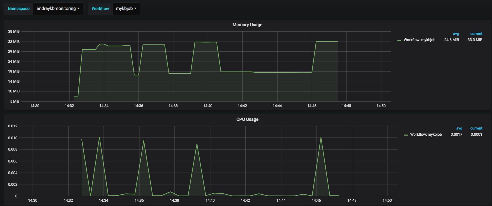

# Grafana dashboard for Kubebench jobs

This dashboard can provide you information about Kubebench job resources (memory usage, CPU usage, Disk IOs per workflow).

## Installation

### Helm and Tiller

* Install [Helm](https://github.com/kubernetes/helm/blob/master/docs/install.md) to your cluster
* Setup your helm repo and tiller deployment on kube-system namespace

```
helm init --service-account tiller --tiller-namespace kube-system
```

* Create tiller service account

```
kubectl create serviceaccount --namespace kube-system tiller
```

* Create tiller cluster role binding for tiller

```
kubectl create clusterrolebinding tiller-cluster-rule --clusterrole=cluster-admin --serviceaccount=kube-system:tiller
```

* Patch your deployment

```
kubectl patch deploy --namespace kube-system tiller-deploy -p '{"spec":{"template":{"spec":{"serviceAccount":"tiller"}}}}'
```

* Upgrade your helm repo

```
helm init --service-account tiller --upgrade
```

After that, you should be able to run ```kubectl get pods --namespace kube-system``` and see tiller running.
As well, you should be able to run ```helm ls``` to see all helm list releases.

### Prometheus deployment

* Add coreos to your helm repository

```
helm repo add coreos https://s3-eu-west-1.amazonaws.com/coreos-charts/stable/
```

* Install prometheus-operator and kube-prometheus deployment on your Kubebench namespace

```
helm install coreos/prometheus-operator --name prometheus-operator --namespace $NAMESPACE
helm install coreos/kube-prometheus --name kube-prometheus --set global.rbacEnable=true --namespace $NAMESPACE
```

After that, you should be able to run ```kubectl get pods --namespace $NAMESPACE``` and see prometheus deployment running.
Also, you can check prometheus services ports ```kubectl get svc --namespace $NAMESPACE``` to access UI for prometheus and grafana. 

### Grafana dashboard

* Get port for ```kube-prometheus-grafana``` service in your cluster.

* Import [JSON](kubebench-dashboard.json) with Kubebench Dashboard to Grafana.
For more information about import/export dashboard to Grafana visit [Grafana](http://docs.grafana.org/reference/export_import/) docs.

## View results

You should be able to see Grafana dashboard with report about workflow resources.


